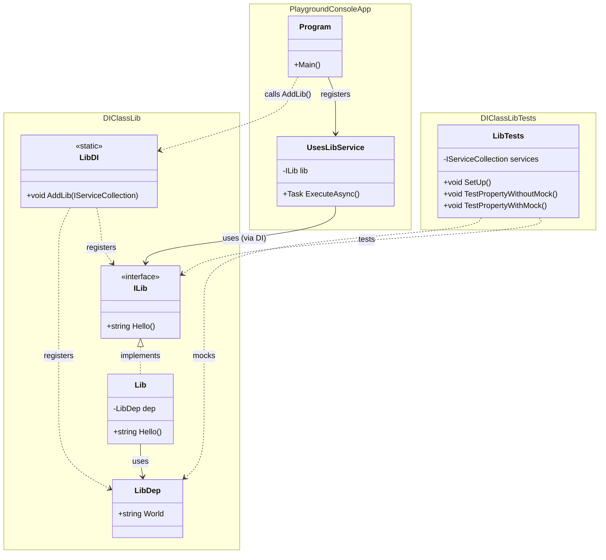

# Using DI with a class library

The `DIClassLib` project uses the `Microsoft.Extensions.DependencyInjection` package. The library implements the extension method `AddLib` for the `IServiceCollection` which registers all necessary dependencies.

[View `LibDI.cs`](./DIClassLib/LibDI.cs)

The `PlaygroundConsoleApp` has to call `AddLib` and can use after that the library via its interface `ILib` injected into the class `UsesLibService`. The advantage is that the console app doesn't know about the internals of the library, but only about its interface.

[View `UsesLibService.cs`](./PlaygroundConsoleApp/UsesLibService.cs)

The following diagram shows how the Dependency Injection of the class library into the console application works and how tests can be written for the class library using mocks.

